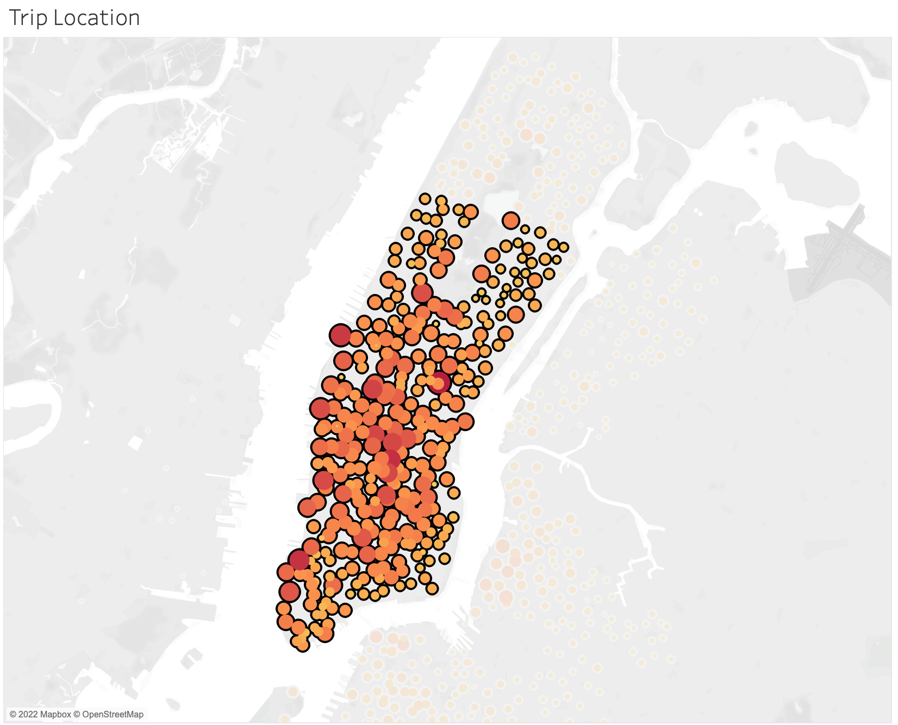
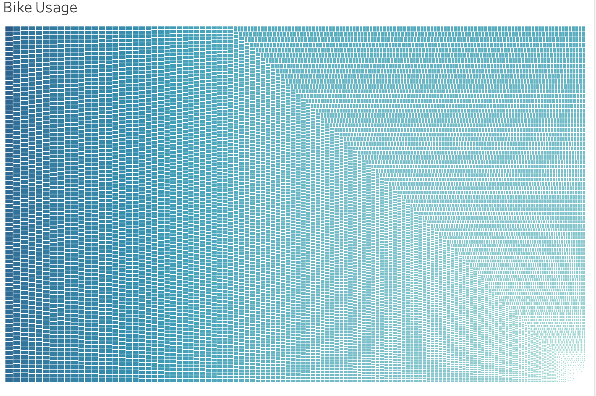

# Bike Share Analysis

## Overview
In this analysis we attempt to understand some key characteristics of the NYC Citibike program to see if it a similar bike share program could be successful in the clients hometown of Des Moines, Iowa. To do this we looked at who Citibike's customers are, when and where they use the bikes and how often as well as trying to understand what level of maintenance a bike share program requires and when the best time to perform maintenance may be. 

We utilized a dataset provided by Citibike and used Tableau to create visualizations that intepret the data.

[Link to Tableau Story](https://public.tableau.com/app/profile/greg.kell1682/viz/CitibikeStory_16562842428310/NYCCitibikeAnalysis/)

## Results

In the month of August (2019) there were 2,344,224 rides taken on Citibike.

Of all the rides, 65% of users were male.

 
A majortiy of rides were taken by people who have a subscription with Citibike.

Bikes are used most heavily during commute times (7-9 am and 5-6 pm) on the weekdays and in the afternoons on the weekend. 

Commute times and weekends are the most popular time for bike usage, regardless of gender.

A majority of rides are less than one hour.

Most rides are taken in Manhattan (the city center). 

One other aspect we wanted to look at is bike usage to determine maintenance schedules. This graph illustrates which bikes (based on ID) are used the most. The most used bike was ridden 479 times in August.

Bikes are used the least between 1 and 4 am, meaning this is the ideal time to perform maintenance and/or swap out bikes.

## Summary
Based on this analysis we can assume that a majority of riders are male, subscription holders who use Citibike in Manhattan, likely as a method of commuting to and from work. If our client is interested in starting a bike share in Des Moines, they should start by looking at this demographic to see if there is an appretite for commuting by bicycle in the city.

Additional visualizations to be considered would be a deeper dive into age and usage. How old are most riders? What ages are most likely to be subscribers? 

[Link to Tableau Story](https://public.tableau.com/app/profile/greg.kell1682/viz/CitibikeStory_16562842428310/NYCCitibikeAnalysis/)

